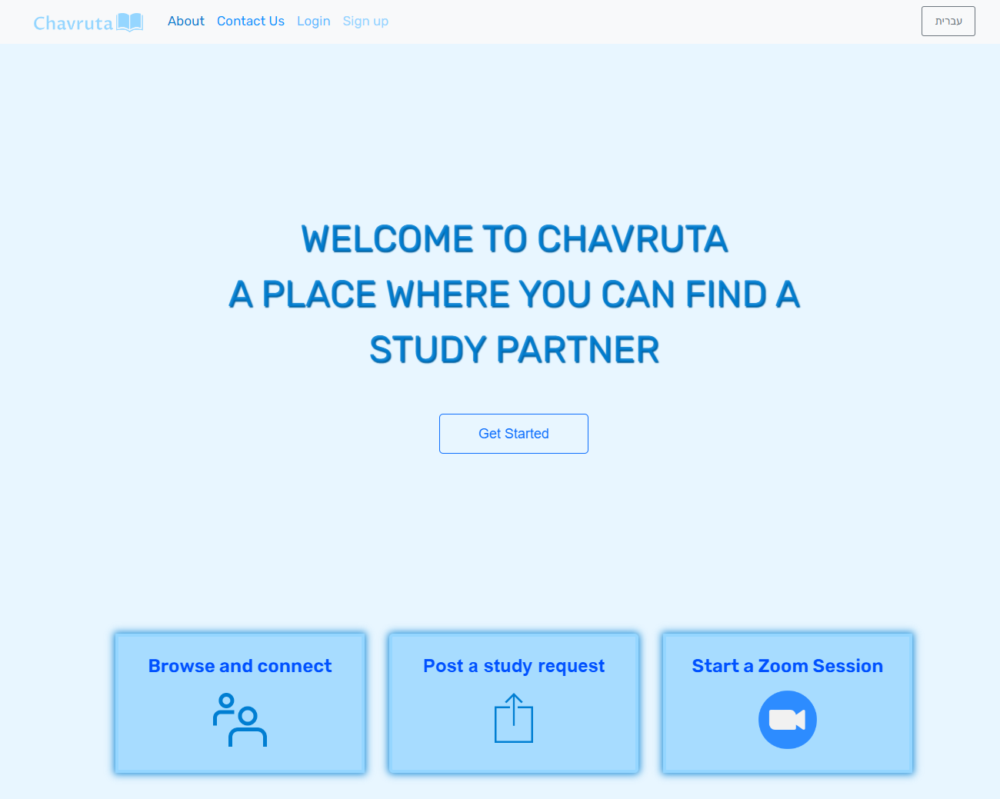

<!-- 
 -->


# Chavruta: Your Study Partner Hub

Welcome to **Chavruta**, a platform where you can find a study partner and enjoy collaborative learning. Below you'll find details about our features and how to get started.

---

## Features

### 1. **Post a Study Request**
Share your study preferences, including the topic, time, and language you prefer. Other users can browse through these requests and express their interest by clicking "Yes." Once you have responses, you have the power to choose the perfect study partner who aligns with your learning goals.


### 2. **Browse and Connect**
Visit our home page to discover study requests posted by fellow learners. If you find a request that matches your interests, simply click "Yes" to connect with the requester. It's a seamless way to join study sessions that align with your schedule and subjects of interest.


### 3. **Start a Zoom Session**
For those ready to dive into immediate learning, use our "Start Zoom Session" feature. Specify the topic, time, language, and the number of participants you'd like in your Zoom session. Our platform will generate a Zoom link for you to share, allowing you to jump into a live study session.


---

## How to Get Started

1. **Sign Up**: Create an account to start posting or responding to study requests.
2. **Post Your Preferences**: Share your study preferences, including the topic, time, and language.
3. **Browse Requests**: Look for study sessions that match your interests and schedule.
4. **Start a Zoom Session**: Initiate an immediate learning session with fellow students.

---

## Screenshots

### Video Preview
### Watch the Demo Video

[](https://youtu.be/f0ZD-e0e4Lc)

Click on the image to play the video.


### Browse and Connect


### Post Study Request


### Start Zoom Session


---

## Getting Started

Follow these steps to run the project locally on your machine.

### Prerequisites

Make sure you have the following installed on your machine:

1. **Visual Studio Code (VS Code)**  
   Download and install VS Code from [https://code.visualstudio.com/](https://code.visualstudio.com/).

2. **Node.js**  
   Download and install Node.js from [https://nodejs.org/](https://nodejs.org/).  
   Verify the installation by running:
   ```bash
   node -v
   npm -v
   ```

3. **Git**  
   Download and install Git from [https://git-scm.com/](https://git-scm.com/).  
   Verify the installation by running:
   ```bash
   git --version
   ```


### Cloning the Repository

1. Open your terminal and navigate to the directory where you'd like to clone the repository.

2. Run the following command to clone the project:
   Verify the installation by running:
   ```bash
   git clone <repository-url>
   ```

3. Navigate into the project directory:
   ```bash
   cd <project-directory>
   ```


### Setting Up the Environment

1. Navigate to the `server` folder:
    ```bash
   cd server
   ```

2. Create a `.env` file inside the `server` folder and add the following environment variables:
   ```bash
    PORT=<your-port>
    USER_DB=<your-db-username>
    PASS_DB=<your-db-password>
    zoom_grant_type=<your-zoom-grant-type>
    zoom_account_id=<your-zoom-account-id>
    zoom_username=<your-zoom-username>
    zoom_password=<your-zoom-password>
   ```
   Replace the placeholders with your actual configuration values.


### Running the Project
## Server

1. Navigate to the `server` folder if you're not already there:
    ```bash
    cd server
    ```

2. Install server dependencies:
    ```bash
    npm install
    ```

3. Start the server:
    ```bash
    npm start
    ```

## Client

1. Open a new terminal and navigate to the `client` folder:
    ```bash
    cd client
    ```

2. Install client dependencies:
    ```bash
    npm install
    ```

3. Start the client:
    ```bash
    npm start
    ```


---

## Technologies Used

- **React**: Frontend framework
- **Redux**: State management
- **AOS (Animate on Scroll)**: For scroll animations
- **Cloudinary**: For image hosting

---

## Contributing

Feel free to contribute to this project by opening an issue or submitting a pull request. Any feedback or suggestions are highly appreciated.

---

## License

This project is licensed under the MIT License.
